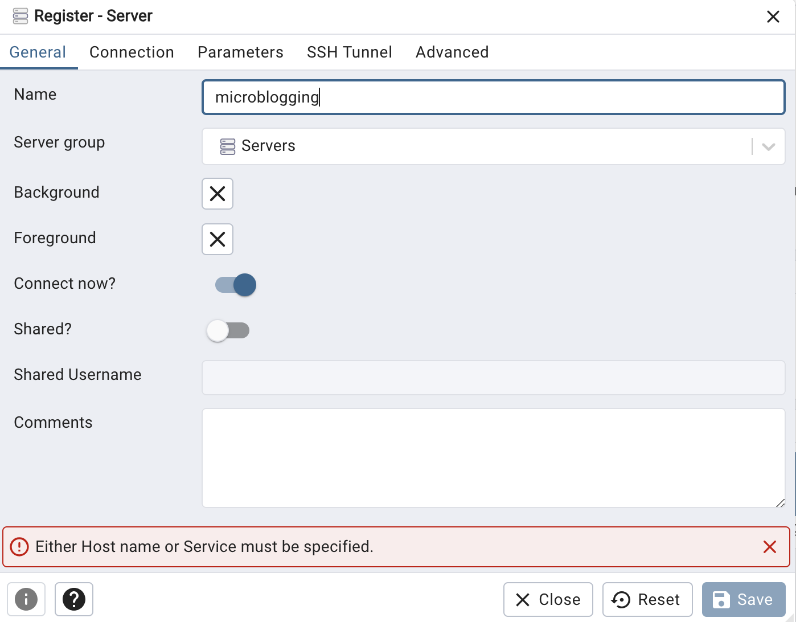
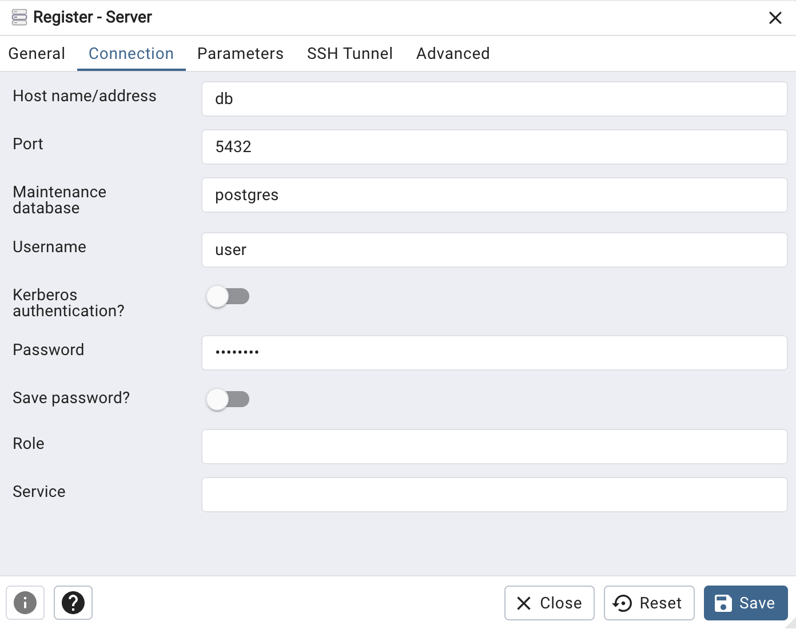

# JustVlogging Platform
<p align="center">
  
</p>

## Overview
The JustVlogging Platform is a web-based application that allows users to post and share their opinions and comments in a microblogging environment. It is designed to be simple yet functional, catering to those who appreciate minimalism in web design.

## Installation and Setup
The application is containerized using Docker and orchestrated with Docker Compose. This setup ensures easy deployment and management of the application and its associated services.

### Prerequisites
- Docker
- Docker Compose

### Steps to Install
1. **Clone the repository**: Clone the project repository to your local machine.
    ```bash
    git clone https://github.com/LarsK4nis/JustVlogging
    ```
2. **Navigate to the project directory**:
    ```bash
    cd /JustVlogging
    ```
3. **Build and run the containers**:
    ```bash
    docker-compose up --build
    ```

## Architecture
The application follows a standard structure for Flask-based applications and includes the following components:

- `app/`: Main application directory with Flask routes, forms, templates, and utility scripts.
- `docker/`: Contains Dockerfiles for setting up the Python/Flask environment and the PostgreSQL database.
- `docker-compose.yml`: Defines and configures the services of the application.

### Services
- **Flask Application**: The main web application built with Flask.
- **PostgreSQL Database**: For storing user and post data.
- **MinIO**: Object storage server for handling image uploads.
- **pgAdmin**: Web-based PostgreSQL database management.

### Credentials
- **pgAdmin**:
  - **URL**: `http://localhost:8080`
  - **Email**: `admin@admin.com`
  - **Password**: `root`
  - **Database_Name**: `microblogging`
  <p align="center">
    
  </p>

  - **HostName/Address**: `db`
  - **Username**: `user`
  - **Password**: `password`

  <p align="center">
    
  </p>
- **PostgreSQL**:
  - **User**: `user`
  - **Password**: `password`

- **MinIOConsole**:
  - **URL**: `http://localhost:9001`
  - **User**: `minioadmin`
  - **Password**: `minioadmin`

## Admin Panel

The `/admin_panel` route provides access to an administrative interface within the application. This panel is exclusively for users with administrative privileges and includes capabilities for managing the application's users and content.

### Accessing the Admin Panel

To access the admin panel, navigate to `/dashboard/admin_panel` after logging in. Access is restricted to users with administrative rights.

### Granting Administrative Privileges

By default, new users do not have administrative rights. To grant a user admin rights, a change must be made directly in the database:

1. Open pgAdmin from `http://localhost:8080`.
2. Navigate to the `microblogging` database.
3. Find the `users` table.
4. Locate the user you wish to grant admin rights to and edit the `is_admin` column to `True`.

Please note that direct database modification should be done with caution and only by those who fully understand the implications of these changes.

### Admin Panel Features

Administrators can perform various tasks such as:

- View a list of all users.
- Delete user accounts.
- Manage posts and comments.
- Access system logs and perform other maintenance tasks.

**Note**: The actual features available in the admin panel may vary based on the current implementation and version of the application. Please refer to the application documentation or contact the development team for the latest feature set.

## Creating Public Buckets in MinIO

To enhance the functionality of our Microblogging Platform, you might need to create public buckets in MinIO for storing and accessing files publicly. This guide will walk you through the process of creating a public bucket using the MinIO console.

### Accessing the MinIO Console

1. **Open your web browser** and navigate to the MinIO console. Typically, the URL is `http://localhost:9000` if you're running MinIO locally.

2. **Log in** using your MinIO credentials. These credentials are specified in the `docker-compose.yml` or the MinIO configuration file.

### Creating a New Bucket

3. Once logged in, **navigate to the 'Buckets' section** in the MinIO console. This section allows you to manage your storage buckets.

4. **Create a new bucket** by clicking on the ‘Create Bucket’ button. Enter a name for your bucket and confirm the creation.

### Setting Up Public Access

5. After creating the bucket, **select it from the bucket list**. Navigate to the 'Access Policy' tab.

6. In the 'Access Policy' tab, you have three options: `None`, `Read Only`, `Write Only`, and `Read and Write`. To make the bucket public, select `Read and Write`. This setting allows public read and write access to your bucket.

7. **Save your changes**. Your bucket is now publicly accessible, and files stored in this bucket can be accessed without authentication.

### Caution

It's important to remember that setting a bucket to public allows anyone to read and write to this bucket. Be cautious about the data you store in public buckets, and avoid storing sensitive information.


### Project Structure
<pre><code>
.
├── README.md                    # Project overview and setup instructions
├── app                          # Main application directory
│   ├── __init__.py              # Initializes the Flask app and configures components
│   ├── forms.py                 # Defines forms for user input
│   ├── minio_utils.py           # Utility functions for MinIO operations
│   ├── models.py                # Database models
│   ├── routes.py                # Flask routes for different endpoints
│   ├── static                   # Contains static files like CSS, JavaScript, and images
│   ├── templates                # HTML templates for rendering views
│   └── utils.py                 # Additional utility functions
├── app.py                       # Entry point to run the Flask application
├── docker                       # Contains Docker related files
├── docker-compose.yml           # Docker Compose file to orchestrate containers
├── requirements.txt             # Python dependencies for the project
└── tests                        # Contains test scripts for the application
</code></pre>

## Testing
The `tests/` directory contains scripts to test various components of the application. Run these tests to ensure the application functions as expected.

## Contributing
Contributions to the project are welcome. Just Vlog it!


